#Getting Started with Kinvey FlexServices

"Pay no attention to the man behind the curtain," goes one of the most famous quotes from the Wizard of Oz. It is also how I felt about many of the software applications I have built over my career. Sure, everything worked, but please don't look at the code!

When you are piecing together disparate systems to build a complex application, sometimes compromises end up getting made. However, the curtain _always_ gets pulled back eventually - usually when I or one of my colleagues had to maintain the app. It's at this point that the cost of these compromises finally becomes clear. That code to integrate a third-party API that was bundled here now needs to work there as well, but it was never written for ease of reuse. 😩

One of the benefits of business logic in the cloud is it can help enable the development of a [microservices architecture](https://martinfowler.com/articles/microservices.html) of loosely-coupled _and reusable_ components. Kinvey offers multiple methods of doing this, but by far the most powerful is [FlexServices](https://devcenter.kinvey.com/nodejs/guides/flex-services) combined with the [Flex SDK](https://www.npmjs.com/package/kinvey-flex-sdk) and [FlexService Runtime](https://devcenter.kinvey.com/nodejs/guides/flexservice-runtime).

### FlexServices Can Help

Using FlexServices, I can build functions containing business logic and third-party API integrations or tie into authentication systems or data integrations that may be otherwise impossible via out-of-the-box integrations. These can be enabled for reuse in a variety of ways, including as custom endpoints that can be called directly, or collection hooks that are called when data is updated or retrieved. A FlexService can also become the system of record for data in a Kinvey collection or for authentication using [Mobile Identity Connect](https://devcenter.kinvey.com/nodejs/guides/mobile-identity-connect).

Obviously, there's a lot to cover here. For this article, I am going to focus on building functions that can be used as custom endpoints or collection hooks. We'll look at how to get started using the FlexService Runtime and then explore [some examples](https://github.com/remotesynth/flex-service-samples) of Flex Functions to see how they are built.

#### Table of Contents

* [Getting Set Up](#toc_3)
	* [Creating a New Project](#toc_4)
	* [Deploying a FlexService](#toc_5)
* [FlexService Examples](#toc_6)
	*  [Moderate Text FlexService](#toc_7)
		* [Using npm Packages](#toc_8)
		* [FlexServices as Collection Hooks](#toc_9)
	* [Email Confirmation FlexService](#toc_10)
		*  [The Temporary Object Store](#toc_11)
		*  [Sending Email](#toc_12)
	*  [Shorten URL FlexService](#toc_13)
		* [External Requests](#toc_14)
		* [Getting Data from Kinvey Collections](#toc_15)
	*  [Text Analytics FlexService](#toc_16)
*  [Local Testing FlexServices during Development](#toc_17)
*  [Going Further](#toc_18)

## Getting Set Up

FlexServices run on a Node.js-based runtime. In order to create and test them locally, you will need [Node.js](https://nodejs.org/en/) (and npm, which is generally included in the Node.js install) installed on your system. You can find [installatin instructions here](https://docs.npmjs.com/getting-started/installing-node#installing-npm-from-the-nodejs-site). It is worth noting that the FlexService Runtime currently runs Node v6 LTS.

Assuming you have Node.js installed, the first thing we need to do to work with FlexServices is to install the Kinvey CLI. This can be installed globally via npm.

```bash
npm install -g kinvey-cli
```

You can see the full list of Kinvey CLI commands by entering `kinvey flex -h`. Assuming the CLI is working properly, let's create a new FlexService.

### Creating a New Project

FlexServices are all built using JavaScript and Node.js. Here are the steps to start a new project:

1. Initialize the project using npm.

	```bash
	npm init
	```
	
	This asks a series of questions before generating the `package.json` - the defaults are fine, but feel free to put whatever you like or run `npm init -y` in order to use the defaults without being prompted.
2. Install the latest version of the Flex SDK and add it to your `package.json` with the `--save` modifier.

	```bash
	npm install kinvey-flex-sdk --save
	```
3. Create the `index.js` file - this will be the entry point to your FlexService. Add the following code:

	```javascript
	const sdk = require('kinvey-flex-sdk');
	
	sdk.service((err, flex) => {
	  
	});
	```
	
	Effectively, this is the boilerplate upon which we will create our FlexService.
4. Write a function. Let's start simple. This function just sends back a static response with a message property.

	```javascript
	function darthVaderQuotes(context, complete, modules) {
		complete().setBody({message: 'I sense something. A presence I have not felt since…'}).done();
	}
	```
	_Note: The `context` and `modules` aren't necessary for this function since they are not used, but I am including them for example purposes as typically you would need and use them._
5. Register the function.

	```javascript
	flex.functions.register('darthVaderQuotes', darthVaderQuotes);
	```
	_Note: In most cases you'd actually assign `flex.functions` to a constant, as you'll need to reference it for every function you register, but, in this example, we are only registering the one. Also, it is recommended that you generally place the handlers in a separate file to make your FlexService easier to read and maintain. You'll see this done in the subsequent examples discussed below._
6. Test the service locally. First start it by using `node .`. To test it, do a POST to `http://localhost:10001/_flexFunctions/darthVaderQuotes`. A tool like [Postman](https://www.getpostman.com/) can assist with this.

	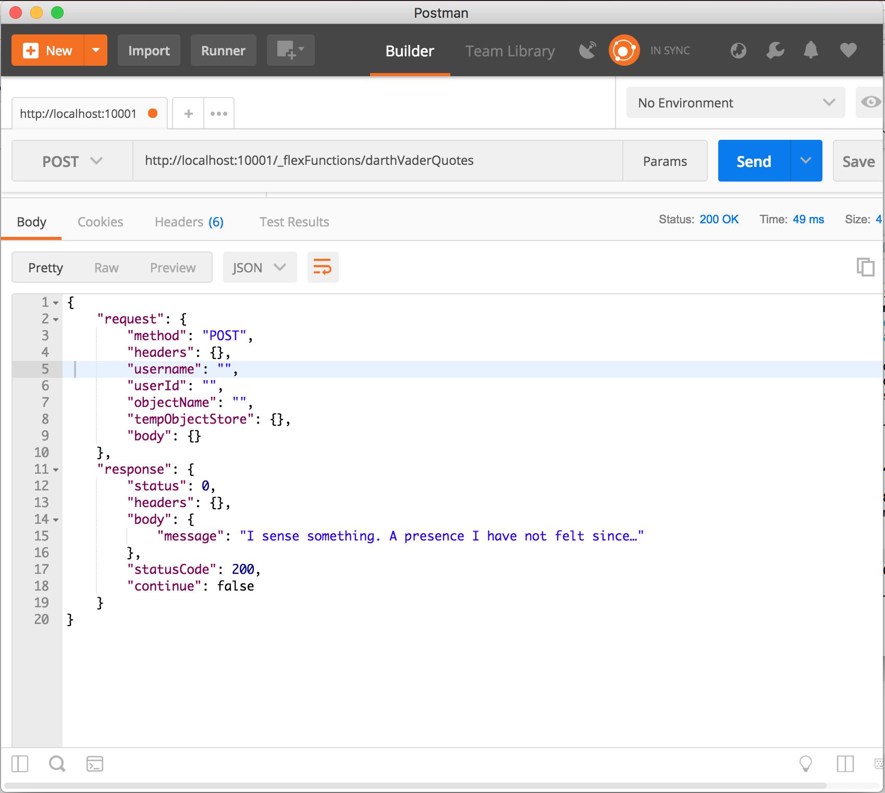

### Deploying a FlexService

Now that we know our FlexService works, let's deploy it.

1. In the [Kinvey Console](https://console.kinvey.com/), choose the "Service Catalog" tab at the top of the page and then click the "Add a Service" button on the right hand side of the page.

	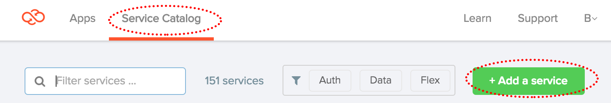
2. Choose the "Flex" option and then "Flex Services Runtime".

	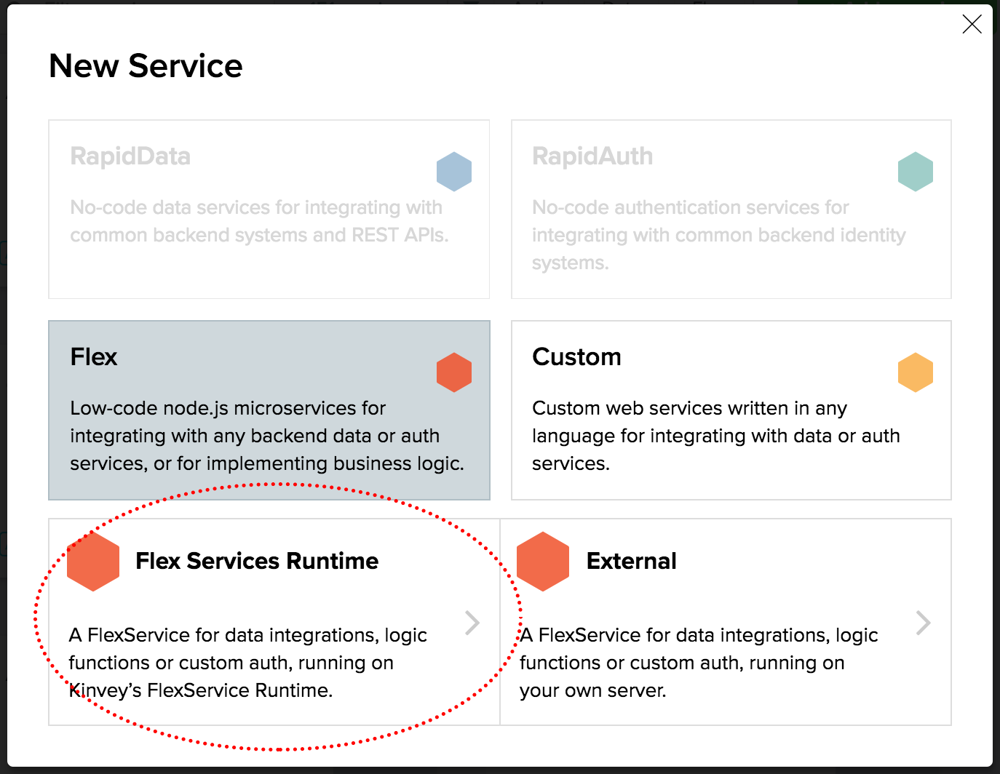
3. Complete the form, giving the service a name, scope (in this case just scope it to an existing app, but if you don't have an app yet, you'll need to create one first), and secret. The name and secret can be anything you like. Save the service.

	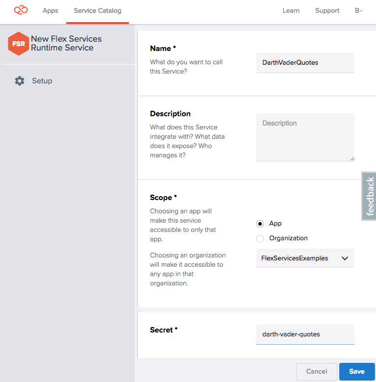
	
	_Note: For future reference, the secret offers an added layer of security when calling the FlexService, however, for our simple example, it isn't necessary._

4. Back in the Terminal/Command prompt, enter `kinvey flex init` to connect your local Kinvey FlexService with the service we just created in the web console. This will run through several prompts to choose your app and then the correct service. When this is done, deploy your app with the `kinvey flex deploy` command.

	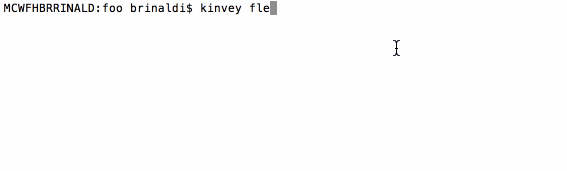
5. To check the status of your deployment, you can use `kinvey flex status`. When the deployment is complete, it should state "status: ONLINE".

	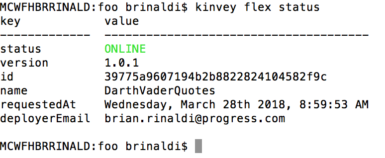
6. Since this is a simple function that just returns a message, we'll just set it up as a [custom endpoint](https://devcenter.kinvey.com/rest/guides/business-logic#custom-endpoints). To do this, go to the "Apps" tab within the Kinvey console and choose the app and environment that you'd like to add the endpoint to then navigate to "Custom Endpoints" and click "Add an Endpoint".

	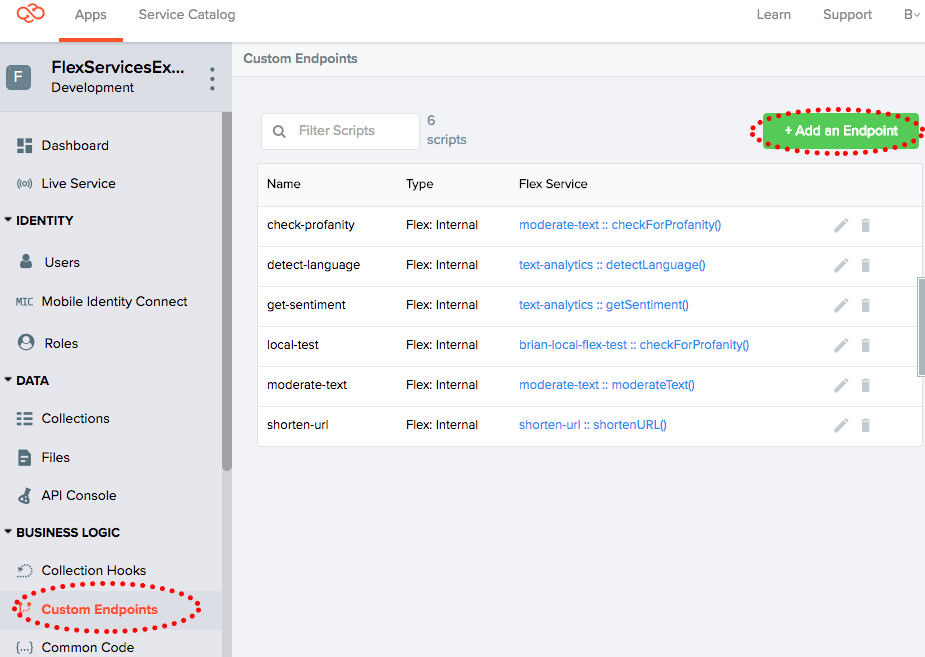
7. Give the endpoint a name and choose the "Microservice" option.

	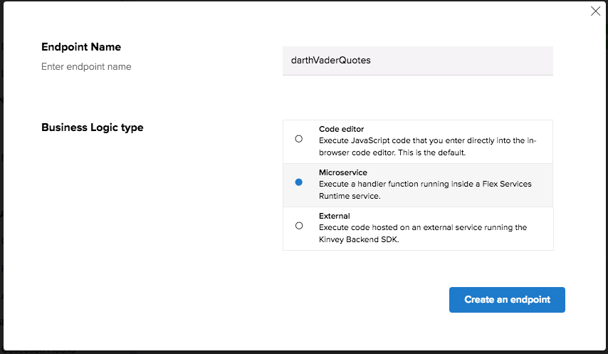

	Then select the correct service and handler from the options (there should be only one handler option in the dropdown for the service, since we've created only one function)
	
	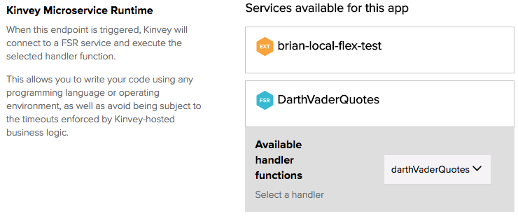

8. To test our endpoint, navigate to the API Console and choose "POST" as the method and select your endpoint from the list of available endpoints.

	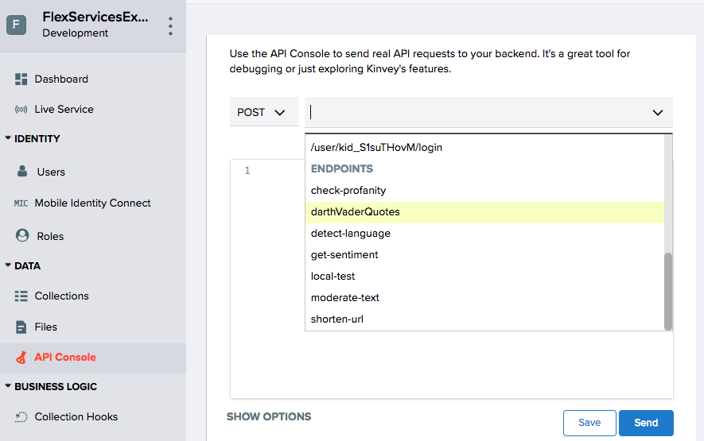
	
	After clicking "Send", the details of the request and the response are displayed.
	
	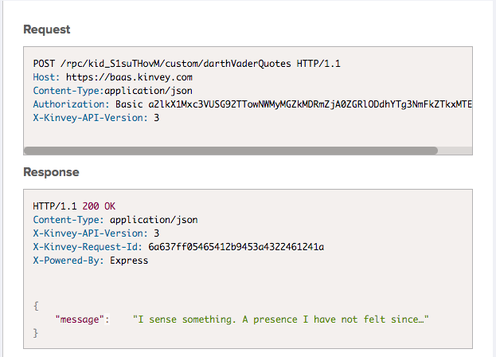

Yay! We have our first FlexService deployed! 🎉

But it really doesn't do anything useful yet. 😞

Now that we've covered the basics, let's look at how we might build something that is actually useful.

## FlexService Examples

To help you get started exploring what FlexServices can do for your application, I built a series of [examples and posted them to GitHub](https://github.com/remotesynth/flex-service-samples). Let's take a brief look at each of these and some of the concepts they demonstrate.

### Moderate Text FlexService

[View on GitHub](https://github.com/remotesynth/flex-service-samples/tree/master/moderate-text)

This FlexService is designed to serve as a simple example of integrating one of the enormous library of [npm packages](http://npmsearch.com/). In this case, it uses an npm library called [bad-words](https://www.npmjs.com/package/bad-words) that is designed to filter out or identify bad language in text.

#### Using npm Packages

To use a library like bad-words in your FlexService, first you need to install it and add it to your `package.json`:

```bash
npm install bad-words --save
```

To make it available within the JavaScript file, you need to `require` it:

```javascript
const Filter = require('bad-words');
```

After this, we just use the library as we would in any other Node.js application.

```javascript
const filter = new Filter();
return filter.isProfaneLike(text);
```
#### FlexServices as Collection Hooks

Functions within a FlexService can be deployed as [collection hooks](https://devcenter.kinvey.com/rest/guides/business-logic#collection-hooks), allowing them to modify, filter, clean or otherwise utilize data as it is being retrieved, saved or deleted in a Kinvey collection. Since our function moderates text, one might imagine you'd want to clean a message before it was inserted as a comment, for example.

To add a FlexService method that has been deployed as a collection hook, go to "Collection Hooks" within the Kinvey web console and then click "Add a Hook".

Choose the collection that you'd like to add a hook to.

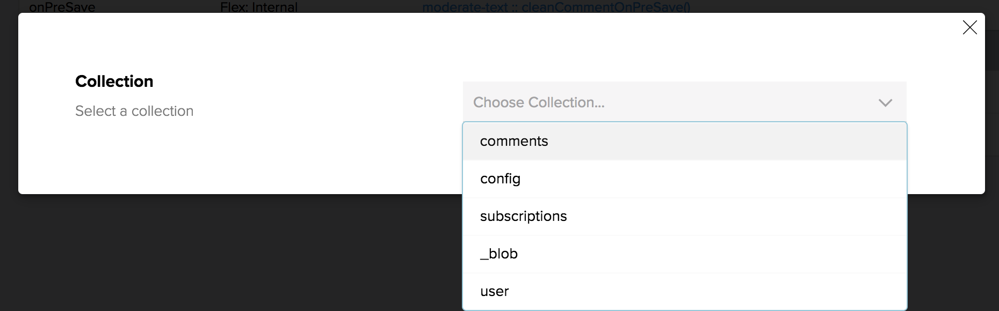

Choose one of the available pre or post hooks.

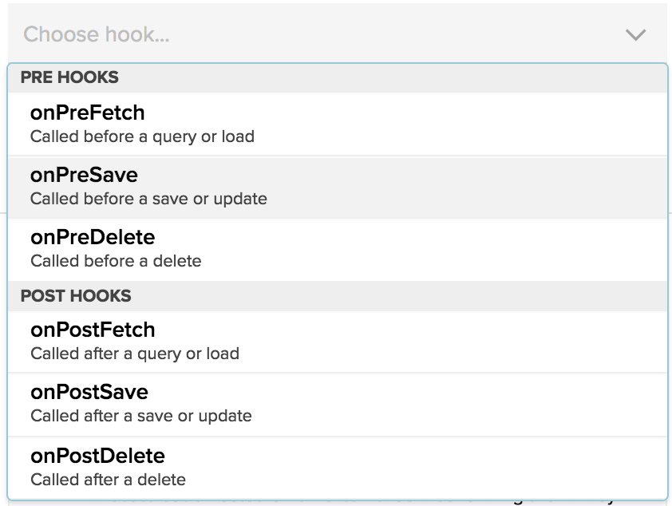

Select "Microservice" and click the "Create Collection Hook" button. On the next screen, find the service and select the method.

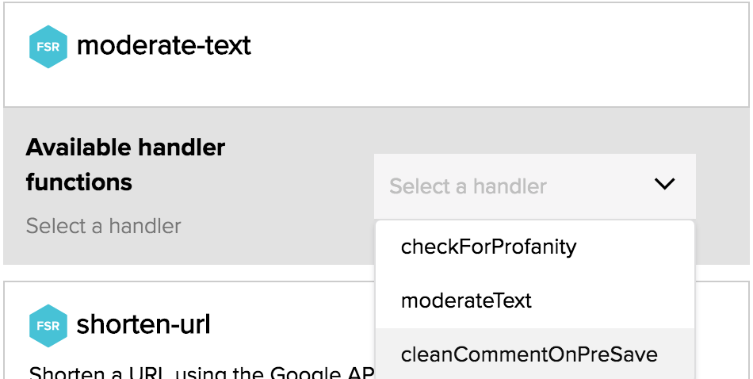

One thing to keep in mind is that a collection hook method will need to set the body of the request if it intends to make any changes to the data being passed in or out.

```javascript
return complete()
    .setBody(result)
    .created()
    .ok()
    .next();
```

### Email Confirmation FlexService

[View on GitHub](https://github.com/remotesynth/flex-service-samples/tree/master/email-confirmation)

This FlexService is designed to serve as an example of how to send an email confirmation when a person signs up for a mailing list or subscription. It has three types of emails that it will send depending on the type of subscription: a new subscription; an existing user who changed their subscription status to subscribe; and, finally, a user who unsubscribed.

In order to accomplish this task, there are two functions designed to be used as a series [collection hooks](https://devcenter.kinvey.com/rest/guides/business-logic#collection-hooks). Collection hooks are functions that run before or after the saving or retrieving of data from a Kinvey collection. In many cases these will modify or massage the data in some manner, but, in this case, the function only checks to see their existing subscription status during the `onPreSave` collection hook and then sends the appropriate email in the `onPostSave` collection hook, once the save has processed in the Kinvey collection.

#### The Temporary Object Store

The two functions that make up this FlexService needed a way to communicate with each other. In this scenario, the `onPreSave` hook needed to inform the `onPostSave` hook what the users subscription status was (new, existing or unsubscribe). To accomplish this, I used the temporary object store.

The [temporary object store module](https://devcenter.kinvey.com/rest/guides/flex-services#temp-object-store-module) is designed to pass small amounts of data between methods in scenarios just like this. It can be accessed via the `modules` value passed into each function:

```javascript
const tempObjectStore = modules.tempObjectStore;
```

Then a value can be set via the `set()` function. For example, here I set a value under the key of `emailType` equal to `unsubscribed`:

```javascript
tempObjectStore.set('emailType', 'unsubscribed');
```
It is later retrieved via the `get()` method:

```javascript
const emailType = tempObjectStore.get('emailType');
```

#### Sending Email

To send the email to the user, I utilized the [email module](https://devcenter.kinvey.com/rest/guides/flex-services#email-module). This module can accessed via the `modules` value passed into each function:

```javascript
const email = modules.email;
```

To send an email, you need to specify the from, to, subject and text body values at a minimum. There are optional values for sending an HTML version of the email body as well as the reply to address and the cc and/or bcc recipients.

To send the email, use the `send()` method. This is an asynchronous method that returns a [promise](https://developer.mozilla.org/en-US/docs/Web/JavaScript/Reference/Global_Objects/Promise).

```javascript
email.send(
  mailOptions.from,
  mailOptions.to,
  mailOptions.subject,
  mailOptions.text_body,
  mailOptions.reply_to,
  mailOptions.html_body,
  mailOptions.cc,
  mailOptions.bcc,
  (err) => {
    if (err) {
      return complete().setBody(err);
    }
    complete()
      .setBody(context.body)
      .ok()
      .next();
  }
);
```

It is worth noting that the email module will not be able to send email when you are testing locally (even when using the External Flex method I discussed [here](https://www.kinvey.com/developing-and-testing-of-kinvey-flex-services-the-easier-way/)).

### Shorten URL FlexService

[View on GitHub](https://github.com/remotesynth/flex-service-samples/tree/master/shorten-url)

This FlexService is designed serve as a relatively simple example of how to connect to a third-party API within a FlexService. In this case, it uses [Google's URL shortener API](https://developers.google.com/url-shortener/v1/getting_started) for which you will need an [API key](https://developers.google.com/url-shortener/v1/getting_started#APIKey).

#### External Requests

Because the FlexService Runtime runs on Node.js, it can integrate [npm packages](http://npmsearch.com/). In this case, I utilized [Request](https://www.npmjs.com/package/request) for the HTTP request required to communicate with the Google API.

To use a library like request in your FlexService, first you need to install it and add it to your `package.json`:

```bash
npm install request --save
```

To make it available within the JavaScript file, you need to `require` it:

```javascript
const request = require('request');
```

Then we can use it as we would in any other Node.js application (Request also returns a [promise](https://developer.mozilla.org/en-US/docs/Web/JavaScript/Reference/Global_Objects/Promise)):

```javascript
request.post(requestOptions, (error, res, body) => {
  if (error) {
    return complete().setBody(error).runtimeError().done();
  }
  complete()
    .setBody({ shortUrl: body.id })
    .done();
});
```

#### Getting Data from Kinvey Collections

Accessing data in a Kinvey collection from within a FlexService isn't difficult - as you likely expect. In the case of this FlexService, as well as the text-analytics service we'll discuss later, rather than hardcode the API key into the service, I decided to access it via a collection that I specifically designed to store configuration values. 

Because FlexServices run within the context of the master key, I can make this collection containing things like my API secrets private but still get access via the FlexService. Only users with master key access (via the Kinvey web console, for example) would have access to these keys. For all intents and purposes, I am using this collection as a type of private [key value store](https://en.wikipedia.org/wiki/Key-value_database).

Let's look at how this collection (named "config") is queried. First, we need a reference to the [dataStore module](https://devcenter.kinvey.com/rest/guides/flex-services#data-store-module) from which we can get a reference to the collection (i.e. config). Finally, we need a reference to the [query module](https://devcenter.kinvey.com/rest/guides/flex-services#query-module) that we will pass when querying this collection.

```javascript
const store = modules.dataStore(options);
const config = store.collection('config');
const query = new modules.Query();
```

Next I set the query object to look for a column (i.e. `configKey`) equal to a value, which, in this case, is the value of the `configKey` variable that equals "Google URL Shortener API".

```javascript
query.equalTo('configKey', configKey);
```

Finally, I query the collection using the `find()` method and passing in this query object.

```javascript
config.find(query, (err, result) => {
  ...
});
```

For simplicity's sake, I have left the implementation of the method off here, but the key thing to remember is that the `find()` method returns a [promise](https://developer.mozilla.org/en-US/docs/Web/JavaScript/Reference/Global_Objects/Promise). You can see the full code [here](https://github.com/remotesynth/flex-service-samples/blob/master/shorten-url/lib/handlers.js).

### Text Analytics FlexService

[View on GitHub](https://github.com/remotesynth/flex-service-samples/tree/master/text-analytics)

This FlexService is designed serve as an example of how to integrate [machine learning](https://en.wikipedia.org/wiki/Machine_learning) APIs within a FlexService. In this case, it uses [Microsoft Azure Text Analytics API](https://azure.microsoft.com/en-us/services/cognitive-services/text-analytics/) for which you will need an [API key](https://azure.microsoft.com/en-us/try/cognitive-services/?api=text-analytics). The Text Analytics API determines the language and/or sentiment of text.

The concepts within the FlexService itself such as accessing collection data, using a method as a custom endpoint and making external API requests have all been covered previously in this article, so I won't belabor them here. One note, however, is that the service utilizes the [https](https://www.npmjs.com/package/https) npm package for its external request. This works slightly differently than the [request](https://www.npmjs.com/package/request) package. If you are curious, check the code for the [FlexService example](https://github.com/remotesynth/flex-service-samples/tree/master/text-analytics).

## Local Testing FlexServices during Development

When building FlexServices there is often a disconnect between the development, which happens locally, and the services, which exist in the cloud. This can lead to particular frustration when you need to interact with services, like data for example, that exist only within the cloud-based app environment.

Fortunately, using Kinvey's support for [External Flex Services](https://devcenter.kinvey.com/rest/guides/external-flex), you can combine local testing with remote data and services in most cases. I have already written a full [guide to local testing using External Flex Services](https://www.kinvey.com/developing-and-testing-of-kinvey-flex-services-the-easier-way/) if you want to learn more about how to use this when building your own FlexServices.

## Going Further

You can access all of the examples as well as documentation for how to use each via my [flex-service-samples repository on GitHub](https://github.com/remotesynth/flex-service-samples).

FlexServices can do more than just the functions I discussed here in this article. You can create custom authentication handlers using [FlexAuth](https://devcenter.kinvey.com/rest/guides/flex-services#flex-auth). This allows you to build a unique authentication flow that matches the needs of your enterprise, even if it isn't supported out-of-the-box by our [Mobile Identity Connect](https://devcenter.kinvey.com/rest/guides/mobile-identity-connect) authentication service. Finally, there is [FlexData](https://devcenter.kinvey.com/rest/guides/flex-services#flex-data), which allows you to build custom data connections for your Kinvey collections, even when not supported by our [RapidData](https://devcenter.kinvey.com/rest/guides/rapid-data) feature.

As I think is clear, FlexServices are really where the true power of Kinvey lies. Once you become comfortable leveraging them, it can opens up all kinds of opportunities for improving your application architecture.